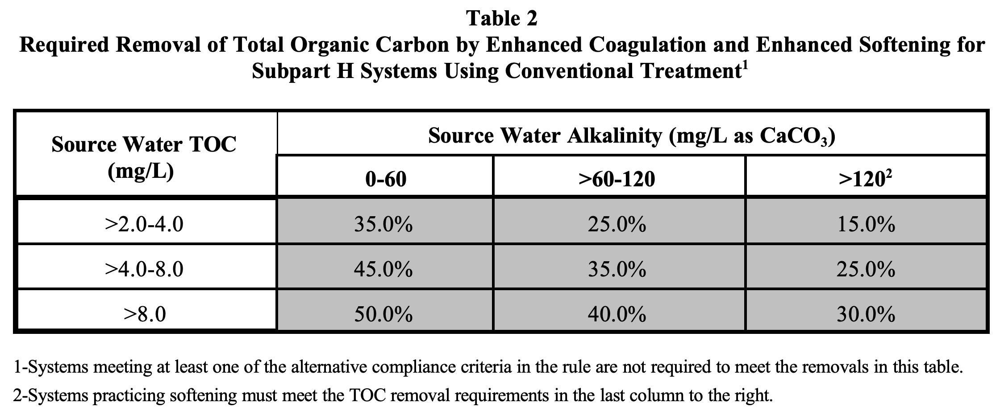

```{r setup, include=FALSE}
knitr::opts_chunk$set(echo = FALSE)
```

```{r}
time <- Sys.time()

# Add last update time
app_time <- format(file.info("ui.R")$mtime, "%Y-%m-%d")
app_update_txt <- paste0("This app was last updated on: ", app_time)

# Read in assessment questions
quest <- read.csv("data/student_questions.csv", row.names = 1)

# Load in text
module_text <- read.csv("data/module_text.csv", row.names = 1)

```


***
### Name: 
### Student ID: 
#### Completed on: 
***

# **Macrosystems EDDIE Module 10: Exploring Tradeoffs in Water Quality Management Using Environmental Data**

# Focal Question:

_How can we use environmental data to inform our understanding of the tradeoffs involved in water management decision-making?_

# Summary: 

Many water management decisions come with tradeoffs. One important example of such a decision is the use of chlorine in the drinking water treatment process. Chlorination is an important disinfection step in water treatment and is needed to protect water consumers from harmful pathogens (such as bacteria). However, when there are high amounts of organic matter in the raw water, chlorination can result in the formation of potentially cancer-causing disinfection byproducts. Environmental sensor data on water quality conditions, such as organic matter measurements from drinking water reservoirs, can help inform water management decision-making and reduce the risk of unintended consequences due to use of chlorine in water treatment.

In this module, you will explore organic matter data collected from drinking water reservoirs and learn how to interpret these data to inform your decision-making about chlorination during drinking water treatment.

\newpage

# Learning Objectives:

By the end of this module, you will be able to:

- Define what disinfection byproducts are.
- Describe the environmental and water treatment processes that influence the formation of disinfection byproducts.
- Understand the trade-offs between disinfection and byproduct formation that can occur when chlorinating water, and treatment techniques that can be used to manage these tradeoffs (e.g., coagulation, activated carbon filters).
- Use environmental data visualizations to identify when additional treatment techniques to avoid disinfection byproduct formation should be used to meet water quality objectives.

## Module overview:

- Introductory presentation on concepts related to drinking water disinfection byproducts (DBPs) and environmental data from drinking water reservoirs
- **Activity A:** Explore how disinfection byproducts are formed during the drinking water treatment process and examine tradeoffs between disinfection and byproduct formation
- **Activity B:** View and interpret environmental data that can indicate when naturally-occurring DBP precursors are present
- **Activity C:** Make water treatment decisions using environmental data that can indicate when DBP precursors may be present

## Module materials:

The lesson content is hosted on an interactive R Shiny web application at [https://macrosystemseddie.shinyapps.io/module10/](https://macrosystemseddie.shinyapps.io/module10/)  

This can be accessed via any internet browser and allows you to navigate through the lesson via this app. You will fill in the questions below on this handout as you complete the lesson activities. Some instructors may ask students to enter their answers to module questions using a Canvas quiz. Confirm with your instructor as to how to submit your answers.

\newpage

## Module workflow:
`r substr(module_text["workflow1", ], 0, nchar(module_text["workflow1", ]))`
`r substr(module_text["workflow2", ], 0, nchar(module_text["workflow2", ]))`
`r substr(module_text["workflow3", ], 0, nchar(module_text["workflow3", ]))`
`r substr(module_text["workflow4", ], 0, nchar(module_text["workflow4", ]))`
`r substr(module_text["workflow5", ], 0, nchar(module_text["workflow5", ]))`
`r substr(module_text["workflow6", ], 0, nchar(module_text["workflow6", ]))`

\newpage

# Module Questions:

## Introduction

### Think about it!

Answer the following questions:  
  
1. `r substr(quest["q1", ], 4, nchar(quest["q1", ]))` 

    a. `r substr(quest["q1a", ], 4, nchar(quest["q1a", ]))`
    b. `r substr(quest["q1b", ], 4, nchar(quest["q1b", ]))`
    c. `r substr(quest["q1c", ], 4, nchar(quest["q1c", ]))`
    
2. `r substr(quest["q2", ], 4, nchar(quest["q2", ]))`  

    a. `r substr(quest["q2a", ], 4, nchar(quest["q2a", ]))`
    b. `r substr(quest["q2b", ], 4, nchar(quest["q2b", ]))`
    c. `r substr(quest["q2c", ], 4, nchar(quest["q2c", ]))`
    
3. `r substr(quest["q3", ], 4, nchar(quest["q3", ]))` 

      a.  `r substr(quest["q3a", ], 4, nchar(quest["q3a", ]))`
      b.  `r substr(quest["q3b", ], 4, nchar(quest["q3b", ]))`
      c.  `r substr(quest["q3c", ], 4, nchar(quest["q3c", ]))`
      d.  `r substr(quest["q3d", ], 4, nchar(quest["q3d", ]))`

\newpage

## Activity A - Explore how disinfection byproducts can be formed during chlorination

`r module_text["act_A", ]`

***
### Objective 1: Understand factors affecting DBP formation and drinking water thresholds for DBPs

***

Be sure you have answered questions 1-3 in the previous Introduction section before you begin Activity A!

4. `r substr(quest["q4", ], 4, nchar(quest["q4", ]))`  

      a.  `r substr(quest["q4a", ], 4, nchar(quest["q4a", ]))`
      b.  `r substr(quest["q4b", ], 4, nchar(quest["q4b", ]))`
      c.  `r substr(quest["q4c", ], 4, nchar(quest["q4c", ]))`
      d.  `r substr(quest["q4d", ], 4, nchar(quest["q4d", ]))`
      e.  `r substr(quest["q4e", ], 4, nchar(quest["q4e", ]))`
      f.  `r substr(quest["q4f", ], 4, nchar(quest["q4f", ]))`
      g.  `r substr(quest["q4g", ], 4, nchar(quest["q4g", ]))`
    
5. `r substr(quest["q5", ], 4, nchar(quest["q5", ]))`

      a.  `r substr(quest["q5a", ], 4, nchar(quest["q5a", ]))`
      b.  `r substr(quest["q5b", ], 4, nchar(quest["q5b", ]))`
      c.  `r substr(quest["q5c", ], 4, nchar(quest["q5c", ]))`

6. `r substr(quest["q6", ], 4, nchar(quest["q6", ]))` 

      a.  `r substr(quest["q6a", ], 4, nchar(quest["q6a", ]))`
      b.  `r substr(quest["q6b", ], 4, nchar(quest["q6b", ]))`
      c.  `r substr(quest["q6c", ], 4, nchar(quest["q6c", ]))` 

   
<br>

***
### Objective 2: Explore tradeoffs in chlorination vs. DBP formation

***

<br>

7. `r substr(quest["q7", ], 4, nchar(quest["q7", ]))` 

      a.  `r substr(quest["q7a", ], 4, nchar(quest["q7a", ]))`
      b.  `r substr(quest["q7b", ], 4, nchar(quest["q7b", ]))`
      c.  `r substr(quest["q7c", ], 4, nchar(quest["q7c", ]))`
      d.  `r substr(quest["q7d", ], 4, nchar(quest["q7d", ]))` 

8. `r substr(quest["q8", ], 4, nchar(quest["q8", ]))` 

      a.  `r substr(quest["q8a", ], 4, nchar(quest["q8a", ]))`
      b.  `r substr(quest["q8b", ], 4, nchar(quest["q8b", ]))`
      c.  `r substr(quest["q8c", ], 4, nchar(quest["q8c", ]))`
      d.  `r substr(quest["q8d", ], 4, nchar(quest["q8d", ]))` 
      
9. `r substr(quest["q9", ], 4, nchar(quest["q9", ]))` 

      a.  `r substr(quest["q9a", ], 4, nchar(quest["q9a", ]))`
      b.  `r substr(quest["q9b", ], 4, nchar(quest["q9b", ]))`
      c.  `r substr(quest["q9c", ], 4, nchar(quest["q9c", ]))`

\newpage

## Activity B - Explore environmental data that can indicate the presence of DBP precursors

`r module_text["act_B", ]`

***
### Objective 3: Select and learn about a focal drinking water reservoir

***

<br>

10. `r substr(quest["q10", ], 5, nchar(quest["q10", ]))`    

     **Answer:**

11. `r substr(quest["q11", ], 5, nchar(quest["q11", ]))`    

     **Answer:**
     
12. `r substr(quest["q12", ], 5, nchar(quest["q12", ]))` 

      a.  `r substr(quest["q12a", ], 4, nchar(quest["q12a", ]))`
      b.  `r substr(quest["q12b", ], 4, nchar(quest["q12b", ]))`
      c.  `r substr(quest["q12c", ], 4, nchar(quest["q12c", ]))`
      d.  `r substr(quest["q12d", ], 4, nchar(quest["q12d", ]))` 

13. `r substr(quest["q13", ], 5, nchar(quest["q10", ]))`    

     **Answer:**

14. `r substr(quest["q14", ], 5, nchar(quest["q14", ]))`    

     **Answer:**

Virginia's Water Quality Assessment Guidance Manual gives the following guidance on water quality evaluation using a trophic state index (TSI), which may be calculated from Secchi depth (SD), chlorophyll-a (CA) in the top 1 meter of the water column, or total phosphorus (TP) in the top 1 meter of the water column:

*"A trophic state index value of 60 or greater for any one of the 3 indices will indicate that nutrient enrichment from anthropogenic sources are adversely interfering, directly or indirectly, with the designated uses. A TSI value of 60 corresponds to a CA concentration of 20 ug/l, a SD of 1 meter, and a TP concentration of 48 ug/l."*

15. `r substr(quest["q15", ], 5, nchar(quest["q15", ]))`    

     **Answer:**  


***
### Objective 4: View and interpret organic matter data from your reservoir

***

16. `r substr(quest["q16", ], 5, nchar(quest["q16", ]))` 

      a.  `r substr(quest["q16a", ], 4, nchar(quest["q16a", ]))`
      b.  `r substr(quest["q16b", ], 4, nchar(quest["q16b", ]))`
      c.  `r substr(quest["q16c", ], 4, nchar(quest["q16c", ]))`
      d.  `r substr(quest["q16d", ], 4, nchar(quest["q16d", ]))` 
     
17. `r substr(quest["q17", ], 5, nchar(quest["q17", ]))` 

      a.  `r substr(quest["q17a", ], 4, nchar(quest["q17a", ]))`
      b.  `r substr(quest["q17b", ], 4, nchar(quest["q17b", ]))`
      c.  `r substr(quest["q17c", ], 4, nchar(quest["q17c", ]))`
      d.  `r substr(quest["q17d", ], 4, nchar(quest["q17d", ]))` 

18. `r substr(quest["q18", ], 5, nchar(quest["q18", ]))` 

      a.  `r substr(quest["q18a", ], 4, nchar(quest["q18a", ]))`
      b.  `r substr(quest["q18b", ], 4, nchar(quest["q18b", ]))`
      c.  `r substr(quest["q18c", ], 4, nchar(quest["q18c", ]))`
      d.  `r substr(quest["q18d", ], 4, nchar(quest["q18d", ]))` 

19. `r substr(quest["q19", ], 5, nchar(quest["q19", ]))`    

     **Answer:**

20. `r substr(quest["q20", ], 5, nchar(quest["q20", ]))`    

     **Answer:**

21. `r substr(quest["q21", ], 5, nchar(quest["q21", ]))`    

     **Answer:**

22. `r substr(quest["q22", ], 5, nchar(quest["q22", ]))`    

     **Answer:**

23. `r substr(quest["q23", ], 5, nchar(quest["q23", ]))`    

     **Answer:**



\newpage 

## Activity C - Use environmental data to inform water treatment decisions

`r module_text["act_C", ]`

***
### Objective 6: Use fluorescent dissolved organic matter data to make coagulation decisions

***
<br>

#### Management decision #1: Winter data
<br>

24. `r substr(quest["q24", ], 5, nchar(quest["q24", ]))`    

     **Answer:**
     
25. `r substr(quest["q25", ], 5, nchar(quest["q25", ]))` 

      a.  `r substr(quest["q25a", ], 4, nchar(quest["q25a", ]))`
      b.  `r substr(quest["q25b", ], 4, nchar(quest["q25b", ]))`
      c.  `r substr(quest["q25c", ], 4, nchar(quest["q25c", ]))`
      d.  `r substr(quest["q25d", ], 4, nchar(quest["q25d", ]))` 

26. `r substr(quest["q26", ], 5, nchar(quest["q26", ]))` 

      a.  `r substr(quest["q26a", ], 4, nchar(quest["q26a", ]))`
      b.  `r substr(quest["q26b", ], 4, nchar(quest["q26b", ]))`

<br>

#### Management decision #2: Spring data
<br>

27. `r substr(quest["q27", ], 5, nchar(quest["q27", ]))`    

     **Answer:**
     
28. `r substr(quest["q28", ], 5, nchar(quest["q28", ]))` 

      a.  `r substr(quest["q28a", ], 4, nchar(quest["q28a", ]))`
      b.  `r substr(quest["q28b", ], 4, nchar(quest["q28b", ]))`
      c.  `r substr(quest["q28c", ], 4, nchar(quest["q28c", ]))`
      d.  `r substr(quest["q28d", ], 4, nchar(quest["q28d", ]))` 

29. `r substr(quest["q29", ], 5, nchar(quest["q29", ]))` 

      a.  `r substr(quest["q29a", ], 4, nchar(quest["q29a", ]))`
      b.  `r substr(quest["q29b", ], 4, nchar(quest["q29b", ]))`

<br>

#### Management decision #3: Summer data
<br>

30. `r substr(quest["q30", ], 5, nchar(quest["q30", ]))`    

     **Answer:**
     
31. `r substr(quest["q31", ], 5, nchar(quest["q31", ]))` 

      a.  `r substr(quest["q31a", ], 4, nchar(quest["q31a", ]))`
      b.  `r substr(quest["q31b", ], 4, nchar(quest["q31b", ]))`
      c.  `r substr(quest["q31c", ], 4, nchar(quest["q31c", ]))`
      d.  `r substr(quest["q31d", ], 4, nchar(quest["q31d", ]))` 

32. `r substr(quest["q32", ], 5, nchar(quest["q32", ]))` 

      a.  `r substr(quest["q32a", ], 4, nchar(quest["q32a", ]))`
      b.  `r substr(quest["q32b", ], 4, nchar(quest["q32b", ]))`

<br>

*`r module_text["acknowledgement", ]`*
*`r app_update_txt`*